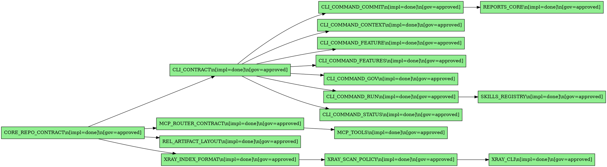

# Cortex Features Overview

This document is auto-generated from `spec/features.yaml` and spec file frontmatter.
Do not edit this file manually. Regenerate with:

```bash
go run ./cmd/cortex features overview
```

## Features by Domain

| ID | Domain | Governance | Implementation | Title | Dependencies |
|----|--------|------------|----------------|-------|--------------|
| CLI_COMMAND_COMMIT | spec | approved | done | CLI Command: Commit | CLI_CONTRACT |
| CLI_COMMAND_CONTEXT | spec | approved | done | CLI Command: Context | CLI_CONTRACT |
| CLI_COMMAND_FEATURE | spec | approved | done | CLI Command: Feature | CLI_CONTRACT |
| CLI_COMMAND_FEATURES | spec | approved | done | CLI Command: Features | CLI_CONTRACT |
| CLI_COMMAND_GOV | spec | approved | done | CLI Command: Gov | CLI_CONTRACT |
| CLI_COMMAND_RUN | spec | approved | done | CLI Command: Run | CLI_CONTRACT |
| CLI_COMMAND_STATUS | spec | approved | done | CLI Command: Status | CLI_CONTRACT |
| CLI_CONTRACT | spec | approved | done | CLI Command Interface | CORE_REPO_CONTRACT |
| CORE_REPO_CONTRACT | spec | approved | done | Repository System Contract | - |
| MCP_ROUTER_CONTRACT | spec | approved | done | MCP Router Contract | CORE_REPO_CONTRACT |
| MCP_TOOLS | spec | approved | done | MCP Tools | MCP_ROUTER_CONTRACT |
| REL_ARTIFACT_LAYOUT | spec | approved | done | Release Artifact Layout | CORE_REPO_CONTRACT |
| REPORTS_CORE | spec | approved | done | Reports: Core | CLI_COMMAND_COMMIT |
| SKILLS_REGISTRY | spec | approved | done | Skills Registry | CLI_COMMAND_RUN |
| XRAY_CLI | spec | approved | done | XRAY CLI | XRAY_SCAN_POLICY |
| XRAY_INDEX_FORMAT | spec | approved | done | XRAY Index Format | CORE_REPO_CONTRACT |
| XRAY_SCAN_POLICY | spec | approved | done | XRAY Scan Policy | XRAY_INDEX_FORMAT |

## Dependency Graph

The following DOT graph shows feature dependencies (colored by implementation state):



## Governance Summary

| Governance | Count |
|------------|-------|
| draft | 0 |
| review | 0 |
| approved | 17 |
| deprecated | 0 |

## Implementation Summary

| Implementation | Count |
|----------------|-------|
| todo | 0 |
| wip | 0 |
| done | 17 |
| deprecated | 0 |
